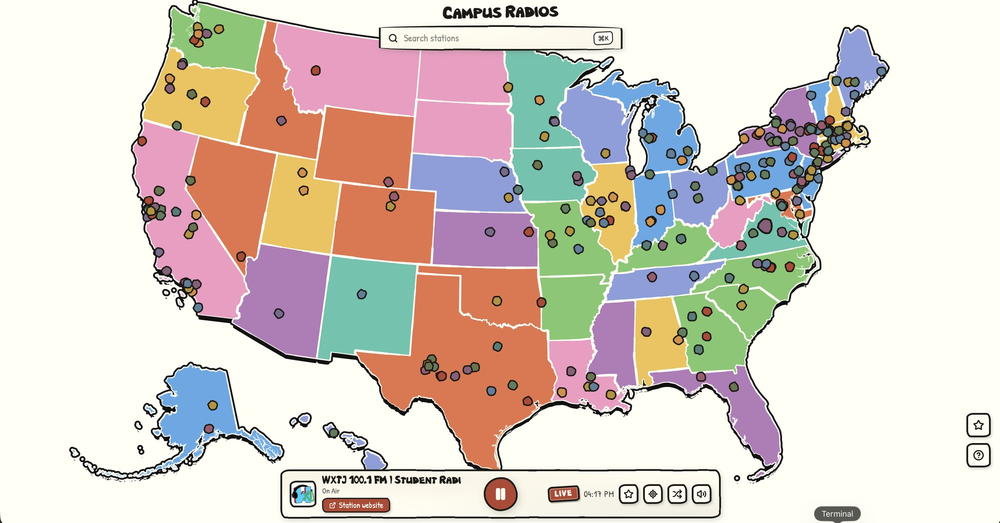

# Campus Radio Map

An interactive map of US college and university radio stations, drawn in the
hand-inked style of Calvin and Hobbes — brushy borders, watercolor state washes,
and hand lettering. Click a dot, hear the stream.

**Live:** https://campusradiomap.vercel.app



## Features

- Every US college/university station plotted on a hand-drawn Albers map (Alaska
  and Hawaii as insets).
- Live playback in the browser — no account, no app.
- Search by station name, state, or school.
- Star stations to save them; favorites persist across reloads.
- Shuffle, locate-on-map, and volume controls in the player.

## Local dev

```sh
npm install
npm run dev
```

`vite dev` serves the static app only — it does not run the `api/` function, so
favorites won't save under it. To run the app together with the favorites API,
use the Vercel runtime:

```sh
npx vercel env pull .env.local
npx vercel dev
```

`npm run build` outputs a static bundle to `dist/`.

## Stations

Stations are local-first: the app loads `public/stations.json`, built offline by
`scripts/update_stations.py` from the community
[radio-browser.info](https://www.radio-browser.info/) directory. If that file is
unavailable, the app falls back to querying radio-browser mirrors live. Refresh
the local list with `scripts/update_stations.py` (or the `update-stations` skill).

Stations with coordinates are plotted exactly; those with only a state are
placed near that state's center with a small deterministic jitter. Playback is a
plain `<audio>` element with a Web-Audio static bed that covers buffering while a
stream connects.

## Favorites

Starring a station saves it server-side, with no login. The browser generates a
random id (stored in `localStorage`) that keys the favorites; that id is the only
thing tying a person to their list. Favorites are stored in a hosted SQLite
database ([Turso](https://turso.tech)) through the `api/favorites.js` function.
No personal data is collected — just the random id, station ids, and timestamps.

## Style

- Ink `#26221c`, newsprint `#f7f2e4`, wagon-red accent `#b5432f`.
- State fills rotate through pale watercolor washes; station dots use a ten-color
  palette hashed from the station id, drawn as wobbly ink blobs.
- Brush wobble comes from SVG `feTurbulence` + `feDisplacementMap` filters; the
  map hover cursor is an inline-SVG hand-drawn dot.
- Two hand fonts: **NBObese** for display titles, **Patrick Hand** for body text.

## Deploying

Hosted on [Vercel](https://vercel.com): the Vite build is served as static files,
and `api/favorites.js` runs as a Node serverless function alongside it. Set
`TURSO_DATABASE_URL` and `TURSO_AUTH_TOKEN` in the project's environment
variables. Deploy a preview with `npx vercel`, promote with `npx vercel --prod`.
