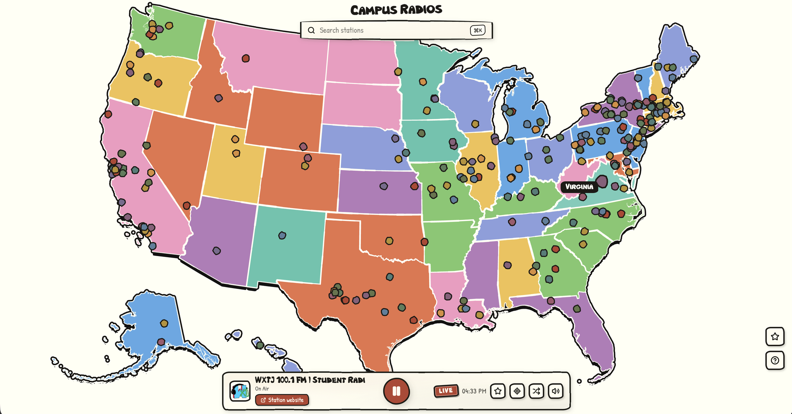

# Campus Radio Map

An interactive map of US college and university radio stations, drawn in the
ink-and-watercolor style of Calvin and Hobbes. Click a station to hear it live.

**Live:** https://campusradiomap.vercel.app



## Features

- College and university stations across the US on a hand-drawn map, with Alaska
  and Hawaii as insets.
- Plays live in the browser. No account needed.
- Search stations by name, state, or school.
- Star a station to save it. Favorites stay when you reload.
- Player controls for shuffle, locate-on-map, and volume.

## Local dev

```sh
npm install
npm run dev
```

`vite dev` serves the static app but does not run the `api/` function, so
favorites will not save under it. To run the app with the favorites API, use the
Vercel runtime:

```sh
npx vercel env pull .env.local
npx vercel dev
```

`npm run build` outputs a static bundle to `dist/`.

## Stations

Stations are local-first. The app loads `public/stations.json`, which
`scripts/update_stations.py` builds offline from the community
[radio-browser.info](https://www.radio-browser.info/) directory. If that file is
unavailable, the app queries radio-browser mirrors live instead. Rebuild the
local list with `scripts/update_stations.py` (or the `update-stations` skill).

Stations with coordinates are plotted exactly. Stations with only a state are
placed near that state's center with a small deterministic jitter. Playback uses
a plain `<audio>` element, with a Web-Audio static bed that covers buffering
while a stream connects.

## Favorites

Starring a station saves it server-side with no login. Each browser gets a random
id (kept in `localStorage`) that its favorites are stored under, in a hosted
SQLite database ([Turso](https://turso.tech)) via `api/favorites.js`.

## Style

- Ink `#26221c`, newsprint `#f7f2e4`, wagon-red accent `#b5432f`.
- State fills rotate through pale watercolor washes. Station dots use a ten-color
  palette hashed from the station id, drawn as wobbly ink blobs.
- Brush wobble comes from SVG `feTurbulence` and `feDisplacementMap` filters. The
  map hover cursor is an inline-SVG hand-drawn dot.
- Two hand fonts: NBObese for display titles, Patrick Hand for body text.

## Deploying

Hosted on [Vercel](https://vercel.com). The Vite build is served as static files,
and `api/favorites.js` runs as a Node serverless function. Set
`TURSO_DATABASE_URL` and `TURSO_AUTH_TOKEN` in the project environment. Deploy a
preview with `npx vercel`, then promote with `npx vercel --prod`.
